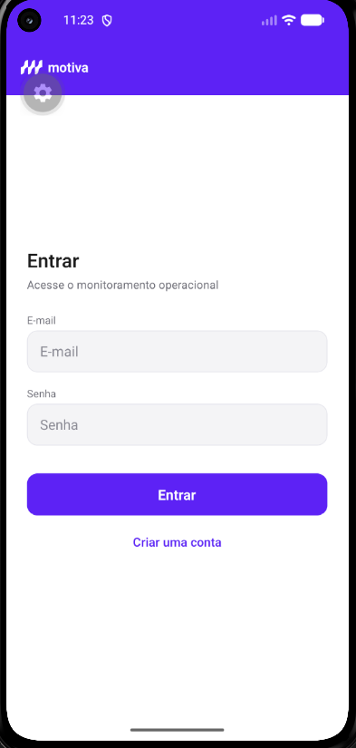
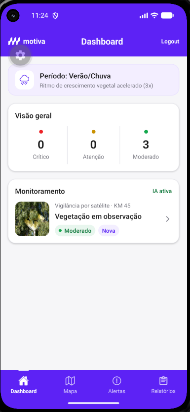
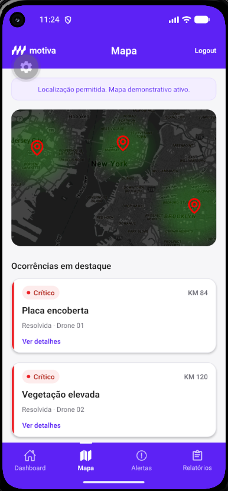
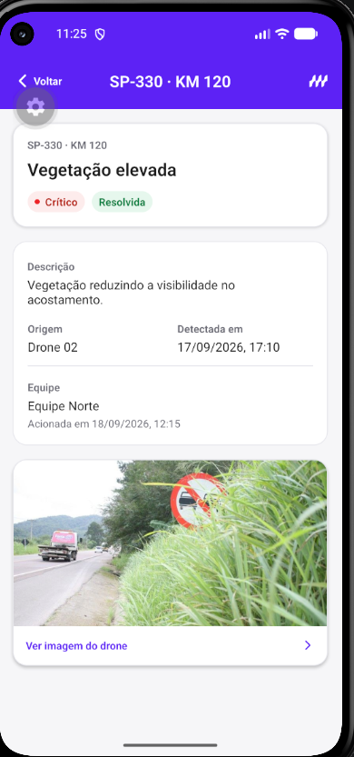
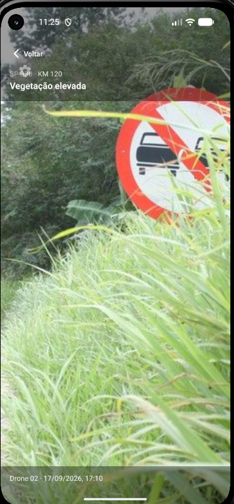
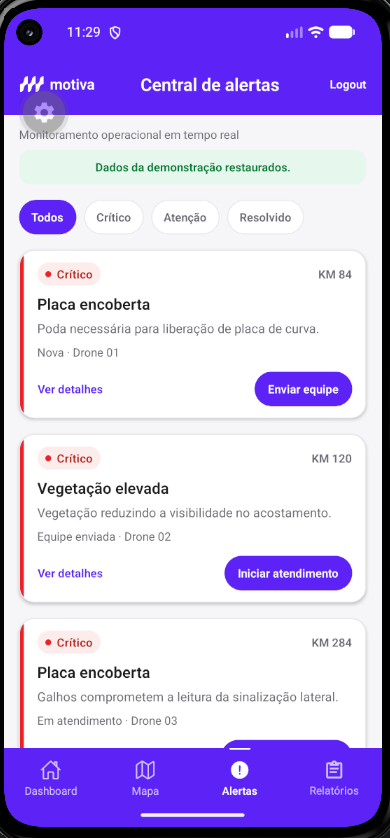
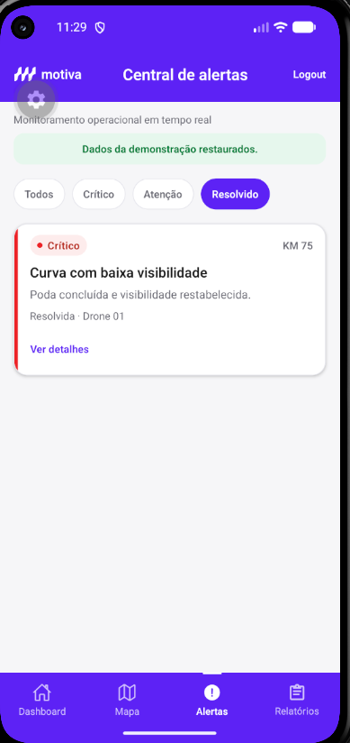
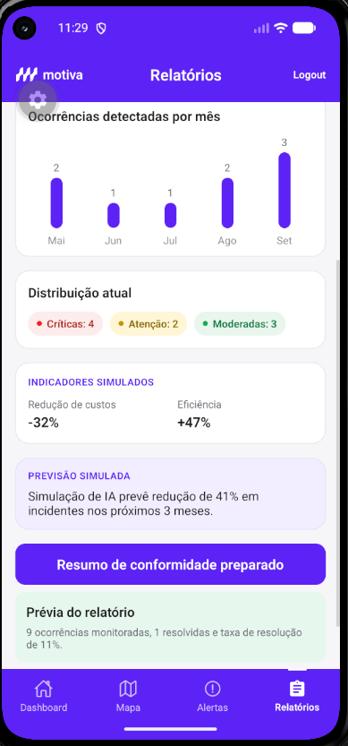

# Motiva Challenge — Monitoramento Inteligente de Vegetação

Aplicativo mobile para monitoramento inteligente de vegetação e apoio à conservação de rodovias da concessionária Motiva.

O projeto foi desenvolvido como uma solução acadêmica para simular a identificação e o acompanhamento de trechos com crescimento excessivo de vegetação, obstrução de placas, canaletas comprometidas e outros riscos relacionados à conservação rodoviária.

---

## 👥 Integrantes do Grupo

| Integrante | RM |
| --- | ---: |
| Amom Ianaguivara Brito | 565718 |
| Victor Chen | 565363 |
| Fernando Antônio de Oliveira | 562549 |
| Vinícius Mello Siqueira | 565257 |
| Gabriel Ramos | 564074 |

---

## 📌 Problema escolhido

O projeto busca reduzir a **ineficiência e a escala limitada das inspeções visuais manuais** utilizadas na conservação das áreas verdes presentes ao longo das rodovias.

Atualmente, a identificação de problemas como mato alto, crescimento acelerado da vegetação, placas encobertas e canaletas obstruídas depende do deslocamento frequente de equipes humanas pelas vias.

Esse modelo apresenta diferentes dificuldades:

- altos custos com combustível, veículos e equipes de inspeção;
- dificuldade para monitorar grandes extensões de rodovia;
- identificação tardia de ocorrências;
- manutenção predominantemente reativa;
- risco de vegetação encobrir placas e comprometer a visibilidade;
- possibilidade de penalidades aplicadas por órgãos reguladores, como ARTESP e ANTT;
- dificuldade para priorizar corretamente as equipes de poda e conservação.

O objetivo da solução é centralizar e organizar as ocorrências operacionais, permitindo identificar criticidade, acompanhar o atendimento e priorizar os pontos que exigem intervenção.

---

## 👤 Persona principal

### Roberto Silva

**Idade:** 42 anos  
**Profissão:** Supervisor de Conservação Rodoviária

Roberto é responsável por coordenar equipes de poda, roçagem, drenagem e manutenção de ativos distribuídos por aproximadamente 400 quilômetros de rodovia.

### Responsabilidades

- acompanhar as condições dos trechos sob concessão;
- coordenar equipes de conservação;
- definir prioridades de atendimento;
- acompanhar ocorrências críticas;
- evitar atrasos e penalidades regulatórias;
- produzir indicadores operacionais;
- comprovar a execução das atividades de manutenção.

### Dificuldades

Roberto possui pouca previsibilidade sobre quais trechos realmente precisam de intervenção.

Frequentemente, equipes são enviadas para locais que ainda não apresentam riscos significativos, enquanto outros pontos permanecem com vegetação elevada, placas encobertas ou canaletas obstruídas.

Além disso, as informações podem estar espalhadas em diferentes relatórios, dificultando uma visão geral da operação.

### Necessidade

Roberto precisa de uma ferramenta centralizada que informe:

- onde existe uma ocorrência;
- qual é o nível de criticidade;
- quais trechos precisam de atendimento imediato;
- onde a vegetação está crescendo rapidamente;
- quais equipes foram acionadas;
- quais ocorrências já foram resolvidas;
- quais resultados operacionais foram obtidos.

---

## 💡 Proposta de solução

A solução é um aplicativo mobile de monitoramento e apoio à decisão para conservação rodoviária, conectado **conceitualmente** a um ecossistema de satélites, drones e análise inteligente de dados.

O fluxo conceitual da solução é dividido em três etapas.

### 1. Vigilância macro por satélite

Satélites podem realizar o monitoramento periódico da vegetação ao longo das rodovias por meio de indicadores como NDVI, auxiliando na identificação de regiões com crescimento acelerado ou comportamento fora do padrão.

Nesta Sprint, essa etapa é representada por dados simulados.

### 2. Inspeção localizada por drones

Depois que uma região é identificada como suspeita, drones podem realizar inspeções visuais mais detalhadas para verificar situações como:

- vegetação elevada;
- placas de trânsito encobertas;
- canaletas de drenagem obstruídas;
- redução da visibilidade;
- riscos em curvas e acostamentos.

No aplicativo, as imagens de inspeção são representadas por assets locais associados às ocorrências mockadas.

### 3. Classificação operacional e aplicativo mobile

As ocorrências são classificadas por criticidade:

- **Crítico:** necessita de intervenção imediata;
- **Atenção:** precisa ser programado para atendimento;
- **Moderado:** permanece em monitoramento.

Além da criticidade, cada ocorrência possui um **status operacional independente**, como:

- nova;
- agendada;
- equipe enviada;
- em atendimento;
- resolvida.

Por meio do aplicativo, o supervisor pode consultar o Dashboard, acompanhar o mapa simulado, abrir detalhes de ocorrências, visualizar imagens de drones, acionar equipes e acompanhar métricas operacionais.

---

## ✅ Status da Sprint 3

A Sprint 3 consolida o protótipo anterior em uma aplicação funcional completa, com fluxos integrados e dados mockados compartilhados entre as telas.

### Funcionalidades implementadas

- cadastro de usuário;
- validação de campos;
- validação de formato de e-mail;
- validação de senha e confirmação de senha;
- login permitido apenas para usuário cadastrado;
- mensagens de erro inline;
- persistência local do usuário e da sessão;
- logout;
- proteção contra envios duplicados em autenticação;
- Dashboard com indicadores derivados do domínio de ocorrências;
- banner sazonal;
- domínio único de ocorrências;
- separação entre criticidade e status operacional;
- sincronização entre Dashboard, Mapa, Alertas e Relatórios;
- navegação por abas inferiores;
- mapa simulado de monitoramento;
- solicitação e tratamento da permissão de localização;
- lista de ocorrências em destaque;
- tela de detalhe da ocorrência;
- visualização de imagens de drone contextualizadas;
- central de alertas;
- filtros por situação;
- fluxo operacional de agendar, enviar equipe, iniciar atendimento e resolver;
- persistência versionada das alterações operacionais;
- métricas e gráfico derivados das ocorrências;
- indicadores estratégicos explicitamente identificados como simulados;
- prévia funcional de relatório de conformidade;
- estados de loading, vazio, erro, retry e ocorrência inválida;
- restauração controlada do cenário de demonstração;
- interface refinada com componentes visuais reutilizáveis e identidade Motiva preservada.

---

## 🧱 Arquitetura da aplicação

A Sprint 3 substituiu conjuntos independentes de mocks por uma única coleção-base de ocorrências.

```text
mockData.js
   │
   ▼
OcorrenciasContext + useReducer
   │
   ├── persistência por patches
   ├── estados de loading/erro/feedback
   └── ações operacionais
   │
   ▼
ocorrenciaSelectors.js
   │
   ├── Dashboard
   ├── Mapa
   ├── Alertas
   ├── Detalhe
   └── Relatórios
```

### Estado compartilhado

O `OcorrenciasContext` centraliza:

- ocorrências;
- status das equipes;
- hidratação;
- feedback de ações;
- transições de status;
- persistência das alterações.

### Seletores

`src/domain/ocorrenciaSelectors.js` concentra cálculos derivados, evitando duplicação de regras entre telas.

### Persistência operacional

O aplicativo não serializa a coleção completa nem imagens locais. O `AsyncStorage` armazena somente **patches versionados** das mudanças operacionais.

Na inicialização:

```text
mock-base + patches persistidos = estado atual
```

Em caso de JSON inválido, versão incompatível ou falha de leitura, o aplicativo utiliza um fallback seguro.

---

## 🛠️ Stack tecnológica

### Aplicação

| Tecnologia | Função |
| --- | --- |
| **JavaScript** | Linguagem principal do projeto |
| **React Native** | Framework mobile |
| **Expo SDK 56** | Ambiente de desenvolvimento e execução |
| **React Navigation** | Stack e Bottom Tabs |
| **AsyncStorage** | Sessão, cadastro e persistência operacional |
| **Expo Location** | Permissão/localização do dispositivo |
| **Expo Vector Icons** | Ícones da interface |
| **Context API + useReducer** | Estado compartilhado das ocorrências |

### Ferramentas

| Ferramenta | Uso |
| --- | --- |
| **Android Studio** | Emulador Android Pixel 5 |
| **Figma** | Protótipo visual original |
| **Git / GitHub** | Versionamento e entrega |

---

## 📋 Requisitos funcionais atendidos

| Código | Requisito |
| --- | --- |
| **RF-001** | Permitir cadastro com nome, e-mail, RM, senha e confirmação de senha. |
| **RF-002** | Validar campos obrigatórios e credenciais. |
| **RF-003** | Permitir login somente para usuário previamente cadastrado. |
| **RF-004** | Persistir os dados locais e a sessão. |
| **RF-005** | Permitir logout. |
| **RF-006** | Exibir Dashboard com indicadores derivados das ocorrências. |
| **RF-007** | Exibir mapa simulado com pontos/ocorrências monitoradas. |
| **RF-008** | Exibir detalhes e imagens associadas às inspeções de drone. |
| **RF-009** | Exibir uma central de alertas operacionais. |
| **RF-010** | Permitir filtrar alertas. |
| **RF-011** | Permitir agendar ou acionar equipe. |
| **RF-012** | Permitir evolução coerente do status operacional. |
| **RF-013** | Refletir alterações de uma ocorrência nas demais telas. |
| **RF-014** | Exibir métricas operacionais e indicadores simulados. |
| **RF-015** | Preparar uma prévia de relatório de conformidade. |
| **RF-016** | Solicitar e tratar permissão de localização. |
| **RF-017** | Persistir alterações operacionais após reinício do aplicativo. |
| **RF-018** | Exibir estados de loading, vazio, erro, retry e item inexistente. |

---

## ⚙️ Requisitos não funcionais

| Código | Requisito |
| --- | --- |
| **RNF-001** | Interface responsiva e adaptável a diferentes tamanhos de tela. |
| **RNF-002** | Preservar identidade visual institucional baseada em roxo, branco e cores semânticas. |
| **RNF-003** | Navegação simples e intuitiva. |
| **RNF-004** | Utilizar dados mockados sem dependência de APIs externas. |
| **RNF-005** | Funcionar no emulador Android Pixel 5. |
| **RNF-006** | Utilizar JavaScript, sem TypeScript. |
| **RNF-007** | Persistir os dados locais relevantes após fechamento do aplicativo. |
| **RNF-008** | Manter carregamentos simulados curtos e previsíveis para demonstração. |
| **RNF-009** | Exibir erros de formulário de forma clara e inline. |
| **RNF-010** | Não causar crash em parâmetros inválidos, localização negada ou falha de hidratação. |

---

## 🎨 Identidade visual

A interface teve origem no protótipo de alta fidelidade criado no Figma e foi refinada na Sprint 3.

A identidade atual utiliza:

- roxo institucional como cor principal de marca e ação;
- fundo claro;
- cards brancos com bordas sutis;
- sombras leves;
- badges e acentos semânticos;
- vermelho para criticidade crítica;
- amarelo/âmbar para atenção;
- verde para moderado e estados resolvidos, com tratamentos visuais distintos;
- status operacional visualmente separado da criticidade;
- navegação inferior com ícones e labels;
- tipografia e espaçamentos mais consistentes.

---

## 🖼️ Capturas de tela


### Login



### Cadastro


### Dashboard



### Mapa de monitoramento



### Detalhe da ocorrência



### Imagem capturada pelo drone



### Central de alertas



### Ocorrência resolvida



### Relatórios



---

## 🗂️ Estrutura principal do projeto

```text
motiva-prototipo/
├── assets/
│   ├── prints/
│   ├── simbolo-motiva.png
│   ├── monitoramento.png
│   ├── mapa.png
│   ├── drone1.png
│   ├── drone2.png
│   └── drone3.png
│
├── docs/
│   ├── TESTES_MANUAIS.md
│   └── PENDENCIAS_SPRINT_4.md
│
├── src/
│   ├── components/
│   ├── context/
│   ├── data/
│   ├── domain/
│   ├── navegacao/
│   ├── storage/
│   ├── telas/
│   └── theme.js
│
├── App.js
├── app.json
├── index.js
├── package.json
├── package-lock.json
├── README.md
└── REQUISITOS.md
```

---

## 🚀 Como executar o projeto

### Pré-requisitos

- Node.js;
- npm;
- Android Studio, caso seja utilizado emulador Android.

### Instalação

```bash
git clone URL_DO_REPOSITORIO
cd motiva-prototipo
npm install
```

Inicie o Expo:

```bash
npx expo start
```

Com o emulador Android aberto, pressione:

```text
a
```

Também é possível iniciar diretamente:

```bash
npx expo start --android
```

Para limpar o cache:

```bash
npx expo start --clear
```

---

## 📦 Dependências principais

As dependências oficiais estão declaradas em `package.json`.

Entre as principais:

- `expo`;
- `react`;
- `react-native`;
- `@react-navigation/native`;
- `@react-navigation/native-stack`;
- `@react-navigation/bottom-tabs`;
- `@react-native-async-storage/async-storage`;
- `expo-location`;
- `@expo/vector-icons`;
- `react-native-safe-area-context`;
- `react-native-screens`.

Não é necessário instalar cada dependência manualmente após executar `npm install`.

---

## 🎨 Protótipo no Figma

O protótipo original apresenta a jornada inicial do aplicativo e serviu como base para a implementação React Native.

A Sprint 3 evoluiu alguns fluxos e estados além do protótipo original, por isso o código atual representa a fonte de verdade da aplicação.

🔗 [Acessar o protótipo no Figma](https://www.figma.com/design/Y3wKlkhxwHISzipeRF67d3/Prot%C3%B3tipo-app---challenge-motiva?node-id=0-1&t=trR4pVo4QEATt4zK-1)

---

## 🧪 Dados simulados

O projeto utiliza dados mockados para representar:

- ocorrências críticas, em atenção e moderadas;
- período climático;
- coordenadas e trechos rodoviários;
- imagens de inspeção;
- alertas;
- equipes;
- estados operacionais;
- métricas;
- indicadores estratégicos e previsão simulada.

Não existe dependência de APIs externas para o funcionamento da Sprint 3.

O baseline contém **9 ocorrências**, sendo:

- 3 críticas abertas;
- 2 em atenção abertas;
- 3 moderadas abertas;
- 1 ocorrência crítica resolvida.

Criticidade e status operacional são conceitos independentes.

---

## 🔄 Fluxos principais

### Autenticação

```text
Cadastro → Login → Dashboard
```

### Monitoramento

```text
Mapa → Detalhe da ocorrência → Imagem do drone
```

### Atendimento

```text
Alerta
→ Agendar/Enviar equipe
→ Iniciar atendimento
→ Resolver
```

As mudanças são compartilhadas entre as telas.

### Relatórios

```text
Ocorrências
→ Métricas derivadas
→ Prévia de conformidade
```

---

## 🧪 Testes manuais

Os testes da Sprint 3 estão documentados em:

[`docs/TESTES_MANUAIS.md`](./docs/TESTES_MANUAIS.md)

Entre os cenários cobertos:

- cadastro e login;
- restauração de sessão;
- Mapa → Detalhe → Drone;
- ações em Alertas;
- sincronização com Dashboard e Relatórios;
- filtros;
- persistência;
- localização negada;
- estados vazio e erro;
- restauração do baseline.

---

## 🚧 Pendências para Sprint 4

As pendências estão documentadas em:

[`docs/PENDENCIAS_SPRINT_4.md`](./docs/PENDENCIAS_SPRINT_4.md)

Entre as possíveis evoluções:

- geração real de PDF;
- integração com APIs/backend;
- autenticação apropriada para produção;
- testes automatizados;
- dados reais de satélite/drone;
- mapa real;
- evolução da camada de análise inteligente.

---

## ⚠️ Observações

Este projeto possui finalidade acadêmica e utiliza dados simulados.

O `AsyncStorage` é utilizado para demonstrar persistência local de cadastro, sessão e operações. Em um produto real, senhas não devem ser armazenadas dessa forma sem criptografia e mecanismos adequados de autenticação.

A tela de Relatórios prepara uma prévia de conformidade baseada nos dados atuais, mas **não gera um arquivo PDF** nesta Sprint.

Satélite, drones, previsão inteligente e demais fontes externas são representados conceitualmente por mocks. O aplicativo não depende desses serviços para executar a demonstração.

---

## 📄 Licença

Projeto desenvolvido exclusivamente para fins acadêmicos.
